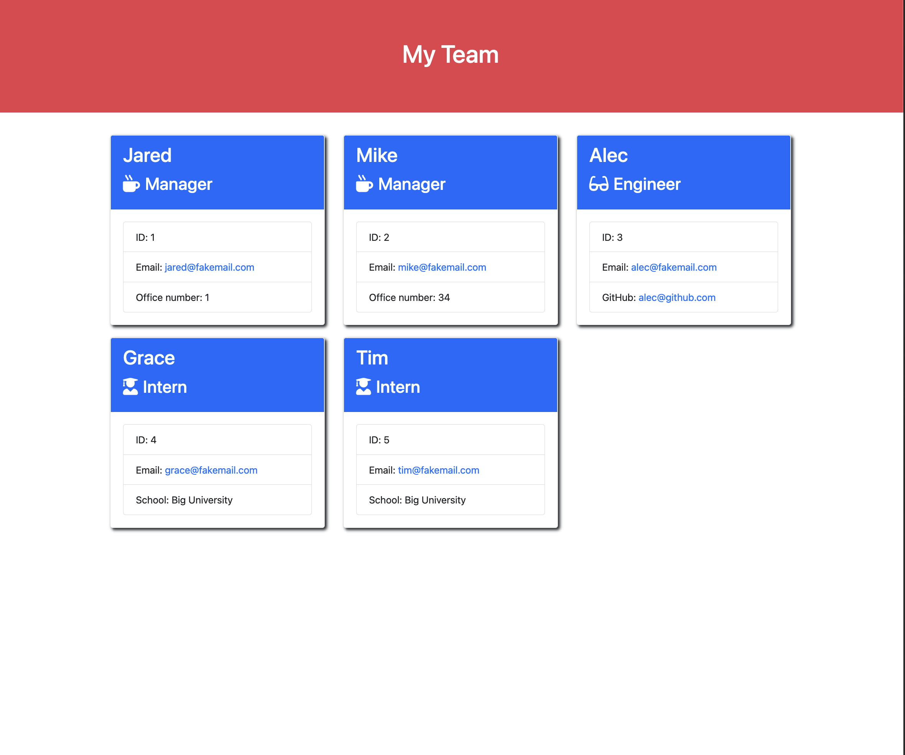
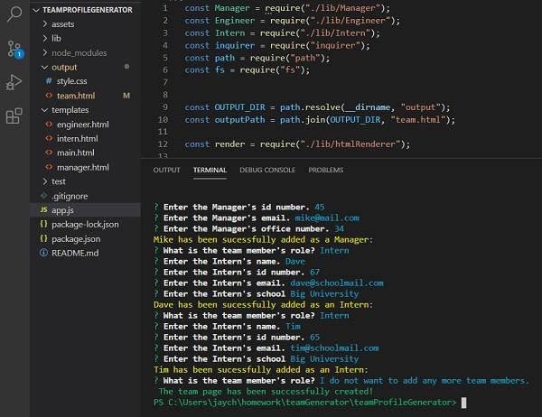
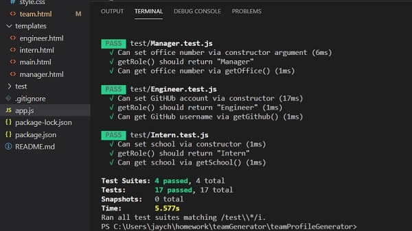

# Team Profile Generator

Module 10 Challenge

## Description 

Your challenge is to build a Node.js command-line application that takes in information about employees on a software engineering team and generates an HTML webpage that displays summaries for each person. Because testing is key to making code maintainable, you’ll also write unit tests for each part of your code and ensure that it passes all of them.

Because this application won’t be deployed, you’ll also need to provide a link to a walkthrough video that demonstrates its functionality and all of the tests passing. You’ll need to submit a link to the video and add it to the README of your project.

In order to install inquirer, please use npm i inquirer@8.2.4.

## User Story

AS A manager
I WANT to generate a webpage that displays my team's basic info
SO THAT I have quick access to their emails and GitHub profiles

## Acceptance Criteria 

GIVEN a command-line application that accepts user input
WHEN I am prompted for my team members and their information
THEN an HTML file is generated that displays a nicely formatted team roster based on user input
WHEN I click on an email address in the HTML
THEN my default email program opens and populates the TO field of the email with the address
WHEN I click on the GitHub username
THEN that GitHub profile opens in a new tab
WHEN I start the application
THEN I am prompted to enter the team manager’s name, employee ID, email address, and office number
WHEN I enter the team manager’s name, employee ID, email address, and office number
THEN I am presented with a menu with the option to add an engineer or an intern or to finish building my team
WHEN I select the engineer option
THEN I am prompted to enter the engineer’s name, ID, email, and GitHub username, and I am taken back to the menu
WHEN I select the intern option
THEN I am prompted to enter the intern’s name, ID, email, and school, and I am taken back to the menu
WHEN I decide to finish building my team
THEN I exit the application, and the HTML is generated

AS A manager
I WANT to generate a webpage that displays my team's basic info
SO THAT I have quick access to their emails and GitHub profiles

## video

Screen recording <a href="https://drive.google.com/file/d/1v_j1EYt5xG02uMGOp1MqbtPZfCcgAzjc/view?usp=sharing" target="_blank">HERE</a>

## Demo 

This is a screenshot of the generated team.html page:

## Installation

To install this application you will need to have node.js installed and you will also need to run [npm install](https://docs.npmjs.com/cli/install) to install the necessary node modules to run the application.

## Tests

This application was tested in node.js using Jest

